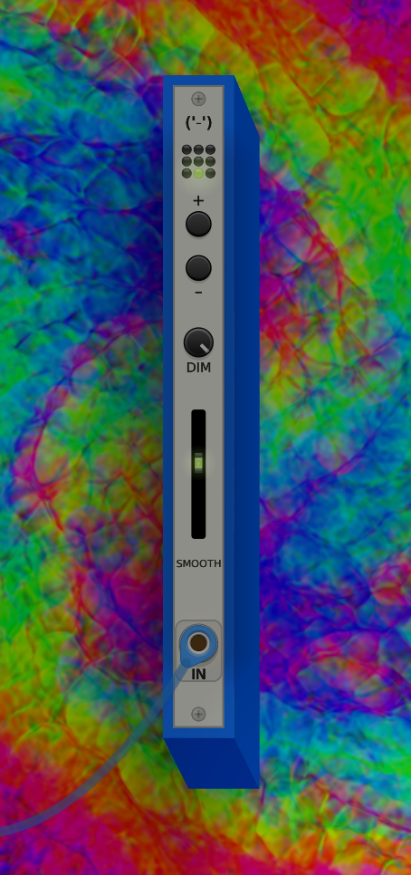

# Pure Dreams

A VCV Rack 2 module that replaces the background with audio-reactive [MilkDrop](https://en.wikipedia.org/wiki/MilkDrop) visuals powered by [projectM](https://github.com/projectM-visualizer/projectm). Works on macOS, Linux and Windows.

<table>
<tr>
<td valign="top"></td>
<td valign="top"> 

<table>
<tr><td align="right"><b>LED grid</b></td><td>current preset index</td></tr>
<tr><td align="right"><b>+/–</b></td><td>next / previous preset</td></tr>
<tr><td align="right"><b>DIM</b></td><td>brightness of the visuals</td></tr>
<tr><td align="right"><b>SMOOTH</b></td><td>how tightly the visuals follow the audio</td></tr>
<tr><td align="right"><b>IN</b></td><td>audio input</td></tr>
</table>

 
<blockquote>Right-click for a searchable list of all presets.</blockquote>

</td>
</tr>
</table>

## more presets

Drop `.milk` files into the plugin's preset folder and restart Rack.

- macOS — `~/Library/Application Support/Rack2/plugins-mac-arm64/PureDreams/res/presets/`
- Linux — `~/.local/share/Rack2/plugins-lin-x64/PureDreams/res/presets/`
- Windows — `%LOCALAPPDATA%\Rack2\plugins-win-x64\PureDreams\res\presets\`

## using with Purfenator

Right-click Purfenator → Colour and Background → untick Draw Background.
